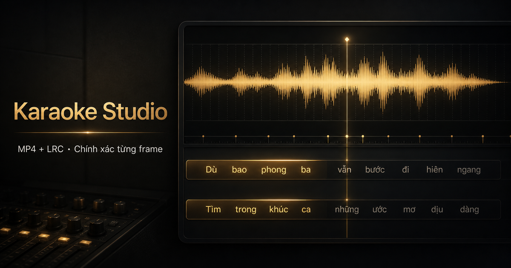

# Karaoke Studio

Karaoke Studio là web app local biến video MP4 và timeline lời LRC/SRT/VTT/TXT thành video Karaoke hai dòng, quét liên tục và được kiểm chứng theo từng frame. Timeline cũng có thể được dán trực tiếp bằng timestamp. Media được xử lý hoàn toàn trên máy; server chỉ bind `127.0.0.1` và không có telemetry hay cloud upload.

> “Verified” không có nghĩa AI tự động chính xác tuyệt đối. Người dùng có thể xuất bất cứ lúc nào; Verified là nhãn chất lượng tùy chọn sau khi nghe A/B và duyệt timing chưa đủ tin cậy.



## Tiếng Việt

### Chức năng đã có trong v0.1.0

- Import MP4/MOV/MKV/WEBM cùng LRC thường/enhanced, SRT, WebVTT hoặc TXT timestamp; cũng có thể dán trực tiếp nội dung timestamp mà không cần tạo file.
- Nền thay thế nhận một hoặc nhiều ảnh/video (tối đa 64 cảnh). App giữ đúng thứ tự tệp người dùng chọn, tự chia toàn bài, ưu tiên dissolve ở khoảng nghỉ/ranh giới câu sau khi AI căn lời, và lưu `background-plan.json` để preview với MP4 xuất ra dùng cùng một lịch cảnh. Ảnh dọc/ngang đều tự phủ kín khung hình; video nền được lặp cục bộ và không thay thế audio đang dùng để kiểm tra timing.
- Kiểm tra nguồn bằng `ffprobe`, SHA-256, audio/video stream, duration, rotation và VFR; editor dùng proxy CFR, nguồn gốc không bị sửa.
- Pipeline tiếp tục được sau gián đoạn nhờ manifest, SQLite WAL, timeline revision và checksum.
- Adapter tách giọng cho Mel-Band RoFormer qua Audio Separator, `htdemucs_ft`, cùng center-cancel fallback bắt buộc kiểm duyệt.
- Maximum Accuracy căn toàn bài bằng hai model CTC trên tối đa hai vocal stem: model chuyên lời hát tiếng Việt làm nguồn chính, model speech CTC làm kiểm chứng độc lập. Sau ensemble, Automatic Sweep Critic nghe lại tối đa ba lượt, chỉ tự sửa control point có đồng thuận mạnh và chuyển vùng không hội tụ sang “Cần nghe”.
- Chuyển động quét `vocal_hybrid` giữ đường CTC theo grapheme tiếng Việt, cho phụ âm đi nhanh và nguyên âm ngân đi chậm; onset/beat chỉ hỗ trợ mốc mơ hồ tối đa 40 ms. Preview và renderer dùng chung nội suy integer `line_progress_ppm`, nên cùng timestamp cho cùng vị trí tô.
- Editor video có hai lyric lane cố định và preview quét trực tiếp. Mỗi câu luôn nằm đúng một hàng: preview đo bề rộng thật rồi tự co riêng câu quá dài, còn renderer MP4 chọn cỡ chữ riêng cho từng câu, nên lời không wrap hoặc tràn từ lane trên xuống lane dưới. Manual Precision không gọi AI: mọi thao tác chọn từ, kéo timing, Undo/Redo, khóa và duyệt câu được tập trung trong `Cuộn timeline toàn bài`; bấm chữ đầu tại đó sẽ nghe xuyên từ đuôi câu trước. Bộ chỉnh `Chuyển tiếp câu` cũng nằm ngay trong bàn chỉnh này, luôn hiện câu trước/câu đang chỉnh/câu sau, báo rõ `CHỒNG`/`NGHỈ`, có preset 0/100/250/500 ms và hai nút đóng dấu đầu phát cho điểm hết câu trên/đầu câu dưới. Hai nút nghe chuyển tiếp luôn phát trọn vẹn cả hai câu liên tiếp đúng một lượt, không cắt theo token đang chọn; `Tiếp tục nghe từ đây` hủy mọi loop/range nghe thử và phát tiếp ngay tại đầu phát hiện tại.
- Dải `Cuộn timeline toàn bài` là bàn chỉnh chính nằm ngay phía trên video MP4, hiển thị mọi câu/từ trên hai lane theo integer microseconds. Lăn chuột hoặc trackpad để rà ngang, đổi ba mức zoom, bấm khoảng trống để seek, hoặc bấm từ để mở đúng câu và nghe loop; mỗi lượt nghe từ có 650 ms lấy đà và 500 ms đuôi để không cắt phụ âm đầu/cuối. Chế độ theo playhead có thể bật/tắt để không giành quyền cuộn tay. Có thể chọn `Kéo từ` hoặc `Kéo câu`, xem vị trí cũ và độ lệch khi kéo, giữ Shift để bắt theo frame, và đặt mốc tay ngay lúc video đang phát để khối timing tự bắt vào mốc gần nhất. Khi kéo, engine chỉ sao chép câu đang đổi và cập nhật trực tiếp các block DOM thuộc câu đó tối đa một lần mỗi animation frame; React không render lại hàng trăm block của toàn bài. Khi thả, timeline tự động PATCH xuống backend bằng optimistic revision, các thay đổi phát sinh trong lúc đang lưu được xếp hàng và xung đột revision được đọc lại rồi lưu tiếp; không cần nút lưu thủ công. Nhấn giữ một khối sẽ dừng mọi audio/video trên trang; thả ra vẫn im lặng và chỉ bấm từ hoặc nút nghe mới phát lại. Mốc tay chỉ lưu local theo từng project.
- Ngay dưới timeline có `Chỉnh lời trực tiếp`: sửa ký tự trong từ, chèn từ trước/sau, xóa từ, thêm câu tại đầu phát hoặc xóa câu. Nội dung người dùng nhập là lời hiển thị duy nhất; hệ thống tự dựng timing/sweep thủ công hợp lệ, đánh dấu vùng mới là `Cần nghe`, hỗ trợ Undo và tự lưu revision xuống backend.
- Timeline mặc định dùng vùng kéo cao, nút và chữ lớn hơn. Nút `Phóng lớn` mở bàn chỉnh gần toàn màn hình để thao tác từ/câu/mốc chính xác; `Esc` hoặc `Thu nhỏ` quay lại workspace mà không mất thay đổi chưa lưu.
- Khung video là preview thụ động, chỉ phát video gốc và hai dòng Karaoke quét liên tục; không có vùng bấm theo từ, tay nắm timing hoặc toolbar nổi che hình. Mọi chỉnh sửa được tập trung duy nhất ở `Cuộn timeline toàn bài`; khối Timing Editor trùng chức năng đã được loại bỏ.
- Trong review và bản có ca sĩ, audio gốc được giữ để nghe căn timing và có watermark `TIMING NOT VERIFIED`. Bản loại giọng có thể xuất ngay khi đã có instrumental; nếu chưa Verified, tên file và `QA_REPORT.json` ghi rõ trạng thái chưa kiểm chứng nhưng không khóa kết quả.
- Renderer RGBA bằng Pillow phát frame trực tiếp vào FFmpeg, không phụ thuộc filter ASS/libass.
- Output mặc định CFR 1920×1080/60fps, H.264 `yuv420p`, AAC 48 kHz/320 kbps và `faststart`; có preset 1080p30 hoặc theo nguồn.
- QA bắt buộc full-decode MP4, kiểm tra duration A/V trong một frame, timeline invariants, SHA-256 và ảnh đại diện trong `QA_REPORT.json`.

### Cài đặt

Yêu cầu: macOS/Linux/Windows, RAM từ 16 GB cho profile Maximum, Python 3.12, Node.js 22+, [uv](https://docs.astral.sh/uv/), pnpm, FFmpeg và FFprobe. Xem [số đo RAM thực tế](docs/RAM_REQUIREMENTS.md).

```bash
uv sync --dev
pnpm install
```

Chạy cả API và giao diện bằng một lệnh trên macOS/Linux:

```bash
./scripts/dev.sh
```

Trên Windows 10/11 x64, mở **PowerShell** tại thư mục dự án rồi chạy:

```powershell
.\scripts\dev.ps1
```

Launcher Windows kiểm tra `uv`, Node.js, `pnpm`, `ffmpeg` và `ffprobe`; đồng bộ dependency đã khóa của app, bao gồm cả hai engine `quality` và `alignment`; sau đó mở API và giao diện chỉ trên `127.0.0.1`. Lần chạy đầu có thể tải nhiều package Python, nhưng checkpoint model chỉ được tải sau khi người dùng chấp nhận giấy phép trong app. Nếu cổng 8000 hoặc 3000 đang bận, launcher tự chọn cổng trống kế tiếp và in đúng URL cần mở. Nhấn `Ctrl+C` một lần để dừng cả API, frontend và các tiến trình con.

Có thể chọn cổng bắt đầu khi cần:

```powershell
.\scripts\dev.ps1 -ApiPort 8010 -WebPort 3010
```

Máy chỉ cần editor thủ công và fallback cơ bản có thể chủ động bỏ các engine AI nặng:

```powershell
.\scripts\dev.ps1 -BaseOnly
```

`-BaseOnly` không phải cấu hình tương đương bản Maximum Accuracy trên Mac.

Nếu Windows chặn script theo Execution Policy, chỉ bỏ qua chính sách cho lần chạy này, không cần thay đổi thiết lập toàn hệ thống:

```powershell
powershell.exe -NoProfile -ExecutionPolicy Bypass -File .\scripts\dev.ps1
```

Trước lần chạy đầu tiên trên Windows, hãy cài Python 3.12, Node.js 22+, [uv](https://docs.astral.sh/uv/), `pnpm` đúng phiên bản ghi trong `package.json`, FFmpeg và FFprobe bản x64, thêm các lệnh đó vào `PATH`, rồi mở lại PowerShell. Với checkout hiện tại, có thể cài đúng pnpm bằng `npm install --global pnpm@11.19.0`. Kiểm tra nhanh bằng:

```powershell
uv --version
node --version
pnpm --version
ffmpeg -version
ffprobe -version
```

Trên Windows, database, media làm việc, model và export mặc định được lưu tại `%LOCALAPPDATA%\KaraokeStudio` để tránh đường dẫn quá dài. Có thể đổi vị trí bằng biến môi trường `KARAOKE_STUDIO_DATA` trước khi chạy launcher; dữ liệu macOS/Linux hiện tại không bị di chuyển.

Runtime PyTorch Windows được khóa hiện tại luôn chạy được bằng CPU. Nếu environment PyTorch trên máy có CUDA hợp lệ, app tự ưu tiên NVIDIA CUDA; nếu không, nó tự về CPU. Có thể ép `KARAOKE_STUDIO_TORCH_DEVICE=cpu` để chẩn đoán, hoặc `cuda` để yêu cầu CUDA và báo lỗi rõ khi driver/runtime chưa sẵn sàng. CI Windows không có GPU nên chỉ xác nhận đường CPU; hiệu năng CUDA phải được đo trên máy Windows/NVIDIA đích.

Hoặc chạy riêng hai terminal:

```bash
pnpm run dev:api
pnpm run dev
```

Mở `http://127.0.0.1:3000`. API local mặc định ở `http://127.0.0.1:8000`; `scripts/dev.sh` tự chọn cổng kế tiếp nếu 8000 đang được ứng dụng khác sử dụng. Kiểm tra sức khỏe tại `/api/health`.

### Engine chất lượng cao tùy chọn

```bash
uv sync --extra quality --extra alignment
```

Bộ Maximum Accuracy dùng [`nguyenvulebinh/lyric-alignment`](https://huggingface.co/nguyenvulebinh/lyric-alignment) chuyên cho lời hát làm model chính và [`nguyenvulebinh/wav2vec2-base-vietnamese-250h`](https://huggingface.co/nguyenvulebinh/wav2vec2-base-vietnamese-250h) làm model kiểm chứng. Model chỉ được tải sau khi người dùng chấp nhận giấy phép một lần cho project; revision được pin, snapshot được SHA-256 và weight nằm trong thư mục dữ liệu local của app (`.karaoke-studio-data/models/` trên macOS/Linux hoặc `%LOCALAPPDATA%\KaraokeStudio\models\` trên Windows), không nằm trong Git. Cả hai model đều CC BY-NC 4.0, không dùng cho mục đích thương mại.

`alignment_profile` có ba mức: `maximum` (mặc định, 2 model × 2 stem), `balanced` (model lời hát × 2 stem) và `fast` (model lời hát × 1 stem). `motion_profile` mặc định là `vocal_hybrid`; hai chế độ nội bộ còn lại là `vocal_only` và `linear`. Automatic Sweep Critic dùng lại bằng chứng CTC và hai vocal stem, không tải thêm model. Nếu thiếu model hoặc stem, job vẫn hoàn thành nhưng `alignment-evidence.json` ghi degraded state và vùng liên quan không thể tự đạt Verified.

Hai separator tùy chọn: [Audio Separator](https://github.com/surfer312/audio-separator) và [Demucs maintained fork](https://github.com/vvigot/demucs). Nếu không cài model, fixture và app vẫn chạy bằng fallback để người dùng chỉnh thủ công.

### Workflow Verified

1. Nhập video, timeline lời và nền tùy chọn. Có thể chọn nhiều ảnh/video cho chế độ tự dựng chuyển cảnh, rồi quyết định có chấp nhận model CTC phi thương mại hay không.
2. App tự chạy tách giọng + căn lời đến hết bài ngay sau khi import; job có thể resume từ artifact hợp lệ.
3. Nghe bản gốc có ca sĩ trong editor. Bấm token để loop; riêng chữ đầu tự phát từ đuôi câu trước. Kéo mốc bằng tai theo 10 ms/1 frame rồi duyệt, không có AI suggestion trong chế độ thủ công.
4. Chỉ kiểm tra các dòng/token có reason code như model/stem bất đồng, câu quá nhanh, nốt ngân chưa chắc, LRC lệch xa hoặc vocal yếu; chỉnh mốc rồi duyệt dòng đó.
5. Sau khi timing ổn, nghe A/B instrumental candidate và xác nhận lựa chọn cuối.
6. Có thể xuất bản có ca sĩ hoặc bản loại giọng bất cứ lúc nào sau khi artifact tương ứng đã sẵn sàng. Khi hàng chờ đã hết và instrumental đã được xác nhận, project chuyển `VERIFIED`; lần xuất Final khi đó được ghi nhận là bản đã kiểm chứng.

Trạng thái chuẩn: `IMPORTED → SEPARATED → ALIGNED → NEEDS_REVIEW → VERIFIED → RENDERED`.

### API chính

| Method | Endpoint | Mục đích |
|---|---|---|
| `POST` | `/api/projects` | Import video, timeline và một hoặc nhiều background |
| `GET` | `/api/projects/{id}/background-plan` | Đọc lịch cảnh nền tự động dùng chung cho preview/render |
| `POST` | `/api/projects/{id}/process` | Chạy/tiếp tục tách giọng và căn lời |
| `GET` | `/api/jobs/{id}/events` | SSE progress, warning và terminal state |
| `GET/PATCH` | `/api/projects/{id}/timeline` | Đọc/sửa `TimelineV1` bằng optimistic revision |
| `POST` | `/api/projects/{id}/timing-suggestions` | API chẩn đoán read-only; Manual Precision không gọi endpoint này |
| `GET` | `/api/projects/{id}/alignment-evidence?line_id=...` | Đọc ứng viên model/stem, độ lệch và lý do cần kiểm tra |
| `POST` | `/api/projects/{id}/instrumental` | Chọn và xác nhận instrumental A/B |
| `POST` | `/api/projects/{id}/verify` | Áp dụng cổng Verified |
| `POST` | `/api/projects/{id}/renders` | Render Draft hoặc Final |
| `GET` | `/api/projects/{id}/artifacts` | Liệt kê stem, proxy, QA và MP4 |

Chi tiết schema, kiến trúc và ranh giới an toàn: [docs/ARCHITECTURE.md](docs/ARCHITECTURE.md), [docs/TIMELINE_V1.md](docs/TIMELINE_V1.md), [SECURITY.md](SECURITY.md), [THIRD_PARTY_NOTICES.md](THIRD_PARTY_NOTICES.md).

### Kiểm thử

```bash
pnpm run check
```

Lệnh này chạy Python lint, API/unit/integration/synthetic render, web lint, TypeScript, timeline interaction tests và production build. GitHub Actions chạy cùng cổng chất lượng trên macOS, Windows và Linux mà không tải model AI hay dùng nhạc có bản quyền.

### Quyền riêng tư, bản quyền và giới hạn

- Chỉ dùng video, audio, lyrics và artwork mà bạn có quyền sử dụng.
- Không separator nào bảo đảm xóa sạch mọi giọng hát; người vận hành phải nghe xác nhận.
- Timeline cấp dòng không tự chứa timing âm tiết. AI tạo đề xuất timing nhưng không được sửa lời; con người quyết định Final.
- Source media, stem, database, cache, model và export đều bị `.gitignore` loại trừ.
- Mỗi dự án trong thanh bên có thao tác xoá hai bước. Khi xác nhận, app dừng job đang chạy và chỉ xoá bản ghi SQLite, video nguồn, stems, lịch sử timeline, QA và exports thuộc UUID dự án đó.
- Năm font Karaoke hỗ trợ tiếng Việt (Noto Sans, Be Vietnam Pro, Lexend, Barlow Condensed và Baloo 2) được bundle local theo SIL Open Font License trong `backend/karaoke_studio/assets/`. Font được lưu theo dự án; preview và MP4 dùng cùng lựa chọn. Mọi câu giữ nguyên chiều cao, câu dài chỉ nén theo chiều ngang.
- Source code dùng giấy phép MIT; dependency và model giữ giấy phép riêng.

## English

Karaoke Studio is a local-first MP4 + multi-format lyric timeline production suite for deterministic, two-lane Karaoke video. It accepts LRC, SRT, WebVTT, plain timestamp text, and pasted timeline content. Its Maximum Accuracy profile combines a Vietnamese singing-specific lyric model and an independent speech CTC model across two vocal stems, then refines fast onsets and sustained endings acoustically. Uncertain evidence is routed to human review before a frame-verified render.

Quick start:

```bash
uv sync --dev
pnpm install
./scripts/dev.sh
```

Windows PowerShell:

```powershell
.\scripts\dev.ps1
```

Open `http://127.0.0.1:3000`. No user media is sent to a cloud service. Review and singer-reference exports keep the original singer and are visibly watermarked. An instrumental Karaoke export can be created whenever its stem is available; pending review points are advisory and are recorded in the QA report instead of locking export. A Verified Final remains the optional quality label for timing and instrumental that have both been reviewed. Optional Vietnamese CTC weights are non-commercial and are never committed to this repository.

## Release policy

`v0.1.0` for macOS may be tagged only after a real Vietnamese MP4 + user-supplied timeline passes the complete QA gate on the target Mac. A Windows x64 release additionally requires the Windows CI runtime gate and one complete native Windows production run; simulated Windows tests on macOS are not sufficient. The repository intentionally contains only code, documentation, OFL fonts, the generated social card and synthetic fixtures.
